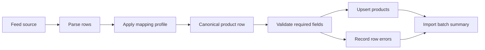

# Feed Mapping

Affiliate networks expose overlapping product concepts under different field
names. The platform keeps those provider details outside the product schema by
using a canonical field registry plus reusable mapping profiles.

## Goals

- Support Daisycon, Awin, TradeTracker, Google Merchant style, and custom feeds.
- Normalize all feeds into one product shape.
- Reuse provider templates while allowing site, partner, or feed-specific edits.
- Keep high-value catalog fields indexed as columns and long-tail fields in JSON.
- Record import batches and row errors for debugging.

## Core Concepts

### Canonical fields

`canonical_fields` is the universal product vocabulary. Each field defines:

- `key`: stable internal name, for example `title`, `price`, `affiliate_url`.
- `field_group`: grouping such as identity, content, pricing, or variants.
- `data_type`: expected normalized type.
- `target_column`: product table column when the field should be queryable.
- `metadata_path`: JSON path under `products.metadata` for long-tail fields.
- behavior flags for required, searchable, filterable, and variant fields.

The initial registry follows the common language used across affiliate feeds and
Google Merchant-style product data:

- Identity: external ID, SKU, GTIN/EAN, MPN, brand, item group.
- Content: title, description, category path, merchant category, product type.
- URLs: merchant URL, affiliate URL, tracking URL, images.
- Pricing: price, old price, currency, shipping cost.
- Availability: stock status, quantity, delivery time, condition.
- Variants: color, size, gender, material, pattern, age group.
- Classification and compliance: Google category, energy label, adult flag.

### Mapping profiles

`feed_mapping_profiles` describes how a source file should be parsed and mapped.
Profiles can be global templates or scoped later to a site or partner.

Important fields:

- `provider`: `awin`, `daisycon`, `tradetracker`, or `custom`.
- `source_format`: `csv`, `xml`, `json`, or `jsonl`.
- parsing defaults such as delimiter, encoding, decimal separator, and row selector.
- locale, timezone, and currency defaults.

Seeded templates:

- `awin-legacy`
- `daisycon-standard`
- `tradetracker-standard`
- `google-merchant`

Templates are intentionally conservative. During feed onboarding, clone or edit a
profile after previewing real rows from the partner feed.

### Field mappings

`feed_field_mappings` connects one source field to one canonical field.

Each mapping can define:

- `source_field`: flat CSV/header field name.
- `source_path`: dot-style nested field path for JSON/XML-normalized rows.
- `fallback_fields`: alternative source fields when networks vary by advertiser.
- `default_value`: value used when the source is empty.
- `transform_type`: normalization step such as money, integer, boolean,
  availability, array, lowercase, uppercase, or copy.
- `transform_config`: transform options, for example an array delimiter.

The mapper reads source rows case-insensitively, applies fallbacks, transforms
values, and returns both canonical keys and product table attributes.

## Import Flow

The first service implementation is `App\Services\Feeds\FeedRowMapper`.

Expected next importer steps:

1. Fetch feed content from URL or API.
2. Parse CSV, XML, JSON, or JSONL into normalized row arrays.
3. Map each row with the selected `FeedMappingProfile`.
4. Validate required canonical fields.
5. Resolve or create site categories.
6. Upsert products by site, partner, and external product ID.
7. Store counters and row errors in `feed_import_batches`.

## Admin Workflow

Filament exposes the mapping setup under the `Feed imports` navigation group:

- `Canonical fields`: manage the universal product vocabulary.
- `Feed mapping profiles`: manage provider templates and scoped mappings.
- `Feed field mappings`: inspect or edit mappings across all profiles.
- `Feed import batches`: inspect import counters and row-level failures.

Most day-to-day work should happen from a mapping profile. Open a profile and
edit its field mappings there so the mapping context stays visible.

## Product Schema Boundary

The product table keeps fields that are likely to be searched, filtered, sorted,
or displayed frequently:

- title, description, brand, price, currency, image URL, affiliate URL.
- GTIN/EAN, MPN, SKU, item group.
- merchant category, product type.
- shipping cost, stock quantity, delivery time.
- common variant fields such as color and size.

Fields that are useful but less universal are stored under `products.metadata`.
Raw source rows can be retained in `products.raw_payload` for traceability and
debugging.
