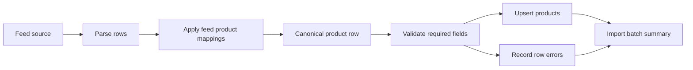

# Feed Mapping

Affiliate networks expose overlapping product concepts under different field
names. The platform keeps those provider details outside the product schema by
using a canonical product-field registry plus feed-specific field mappings.

## Goals

- Support Daisycon, Awin, TradeTracker, Google Merchant style, and custom feeds.
- Normalize all feeds into one product shape.
- Use provider templates as draft suggestions, then store the final mapping on the feed.
- Keep high-value catalog fields indexed as columns and long-tail fields in JSON.
- Record import batches and row errors for debugging.

## Core Concepts

### Canonical fields

`canonical_fields` is the universal product vocabulary. Each field defines:

- `key`: stable internal name, for example `title`, `price`, `affiliate_url`.
- `field_group`: grouping such as identity, content, pricing, or variants.
- `data_type`: expected normalized type.
- `target_column`: product table column when the field should be queryable.
- `metadata_path`: JSON path under `products.metadata` for long-tail fields.
- behavior flags for required, searchable, filterable, and variant fields.

The initial registry follows the common language used across affiliate feeds and
Google Merchant-style product data:

- Identity: external ID, SKU, GTIN/EAN, MPN, brand, item group.
- Content: title, description, category path, merchant category, product type.
- URLs: merchant URL, affiliate URL, tracking URL, images.
- Pricing: price, old price, currency, shipping cost.
- Availability: stock status, quantity, delivery time, condition.
- Variants: color, size, gender, material, pattern, age group.
- Classification and compliance: Google category, energy label, adult flag.

### Feed-specific mappings

Every `feeds` record stores parsing settings such as source format, delimiter,
encoding, decimal separator, row selector, request headers, query parameters,
credentials, schedule, and import strategy. The actual field mapping is stored
in `feed_product_field_mappings`, scoped to that feed.

Important fields:

- `provider`: `awin`, `daisycon`, `tradetracker`, or `custom`.
- `source_format`: `csv`, `xml`, `json`, or `jsonl`.
- parsing defaults such as delimiter, encoding, decimal separator, and row selector.
- import strategy toggles for creating, updating, disabling, or deleting products.

Provider templates are now config-only draft helpers:

- `awin-legacy`
- `daisycon-standard`
- `tradetracker-standard`
- `tradetracker-json`
- `tradetracker-xml`
- `google-merchant`

Templates are intentionally conservative. During feed onboarding, analyze the
real feed, choose the primary element, create draft mappings from the feed page,
then edit or skip individual product fields.

### Product field mappings

`feed_product_field_mappings` connects one source field to one canonical field
for one feed.

Each mapping can define:

- `source_field`: flat CSV/header field name.
- `source_path`: dot-style nested field path for JSON/XML-normalized rows.
- `fallback_fields`: alternative source fields when networks vary by advertiser.
- `default_value`: value used when the source is empty.
- `transform_type`: normalization step such as money, integer, boolean,
  availability, array, lowercase, uppercase, or copy.
- `transform_config`: transform options, for example an array delimiter.

The mapper reads source rows case-insensitively, applies fallbacks, transforms
values, and returns both canonical keys and product table attributes.

## Import Flow

The first service implementation is `App\Services\Feeds\FeedRowMapper`.

Expected next importer steps:

1. Fetch feed content from URL or API.
2. Parse CSV, XML, JSON, or JSONL into normalized row arrays.
3. Map each row with the feed's `feed_product_field_mappings`.
4. Validate required canonical fields.
5. Resolve or create site categories.
6. Upsert products by site, partner, and external product ID.
7. Store counters and row errors in `feed_import_batches`.

## Admin Workflow

Filament exposes the mapping setup under the `Feed imports` navigation group:

- `Partners`: manage affiliate networks or merchants.
- `Feeds`: attach a partner feed to a site, analyze source data, create draft
  mappings, choose an import strategy, schedule, and run imports.
- `Product fields`: manage the universal product vocabulary.
- `Feed import batches`: inspect import counters and row-level failures.

Most day-to-day work should happen from the feed detail page. Open a feed and
edit its product field mappings there so the source samples and import settings
stay visible.

## Attaching a Feed to a Site

The setup order is:

1. Create or confirm the `Site`, for example `hartslagmeters.nl`.
2. Create a `Partner` for the network or merchant, for example an Awin advertiser.
3. Create a `Feed`.
4. Select the Site, Partner, provider, source type, source URL or uploaded file,
   request headers/query parameters if needed, and parsing settings.
5. Analyze the source, choose the primary element, create draft mappings, edit
   fields, and choose the import strategy.
6. Keep the feed active when it is ready for imports.

You can create feeds from the global `Feeds` section or from a site's detail page
under the site's `Feeds` relation tab. A feed belongs to exactly one site, so the
same source feed should be added separately when multiple domains need different
category strategy, product selection, or mapping overrides.

## Product Schema Boundary

The product table keeps fields that are likely to be searched, filtered, sorted,
or displayed frequently:

- title, description, brand, price, currency, image URL, affiliate URL.
- GTIN/EAN, MPN, SKU, item group.
- merchant category, product type.
- shipping cost, stock quantity, delivery time.
- common variant fields such as color and size.

Fields that are useful but less universal are stored under `products.metadata`.
Raw source rows can be retained in `products.raw_payload` for traceability and
debugging.
